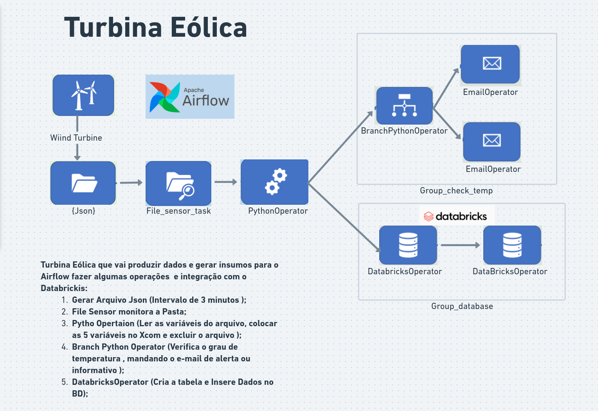

# TURBINA_EOLICA
<h1>Turbina Eólica</h1> 

### Tópicos 

<h2>Turbina Eólica que vai produzir dados e gerar insumos para o Airflow fazer algumas operações  e integração com o Databrickis:<h2>

    1. Gerar Arquivo Json (Intervalo de 3 minutos );
    2.  File Sensor monitora a Pasta;
    3. Pytho Opertaion (Ler as variáveis do arquivo, colocar as 5 variáveis no Xcom e excluir o arquivo );
    4. Branch Python Operator (Verifica o grau de temperatura , mandando o e-mail de alerta ou informativo );
    5. DatabricksOperator (Cria a tabela e Insere Dados no BD);
    
    
  <link></link>

  
 Link whimsical <a href="https://whimsical.com/turbina-eolica-vertical-HapdrJPBcaozePY3FjXv25">https://whimsical.com/turbina-eolica-vertical</a>

  

  
  

    
