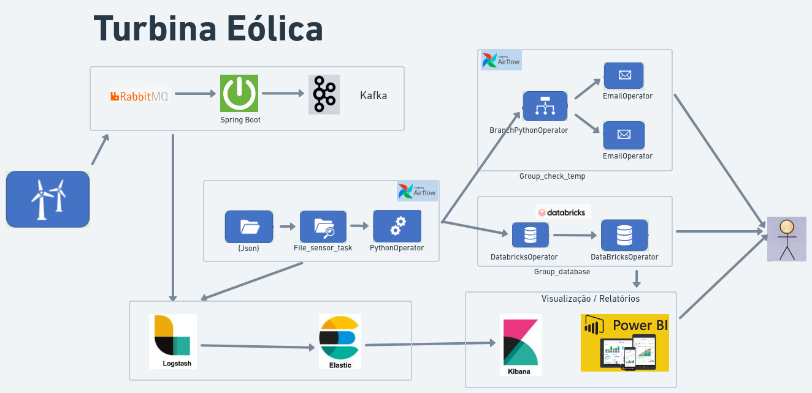

# Projeto-Turbina Eólica

 Projeto Tecnologias de Big Data

##### 1) DEFINIÇÃO DE UM PROBLEMA 

  Garantir o acompnhamento dos valores atingidos da temperatura gerada no processo de geração de energia

##### 2) DEFINIÇÃO INGESTÃO EM DADOS (LOCAL DA ORIGEM, PODE JA EXISTIR OU PODE SER GERADO)
 
  Turbina Eólica que vai produzir dados e gerar insumos para os sensores mapearem os valores atingidos da temperatura, informando a normalidade ou críticas no processo de geração de energia

##### 3) DEFINIÇÃO ARQUITETURA (DESENHO NO MINIMO DE 2 PARTES DO TODO INGESTÃO E AMAZENAMENTO)
  
 Link whimsical <a href="https://whimsical.com/turbina-eolica-vertical-HapdrJPBcaozePY3FjXv25">https://whimsical.com/turbina-eolica-vertical</a>

  
Turbina Eólica que vai produzir dados e gerar insumos para os sensores mapearem os valores atingidos da temperatura, informando a normalidade ou críticas no processo de geração de energia:

    · Turbina gera a requisição no formato json (Intervalo de 3 minutos );
    · RabbitMQ recebe essas informações; 
    · Spring Boot faz a transformação e envia para o Kafka;
    · Spring Boot consome os dados do kafka e gera os arquivos na  pasta do sensor do Airflow; 
    · Trilha de auditoria/log sendo processado pelo logstash;
    · Logstash fazendo a ingestão e transformação dos dados para o elasticsearch;
    · Visualização dentro do kibana;
    · File Sensor monitora a Pasta;
    · Pytho Opertaion (Ler as variáveis do arquivo, colocar as variáveis no Xcom e excluir o arquivo ); 
    · Branch Python Operator (Verifica o grau de temperatura , mandando o e-mail de alerta ou informativo );
    · DatabricksOperator (Cria a tabela e Insere Dados no BD);
    · Entrega  dos relatórios pelo Kibana e Power BI;

 ##### 4) IMAGEM DOCKER 

Airflow,
Nifi,
Logstash,
Elasticsearch e 
Kibana

##### 5) SUBIR NO GIT
