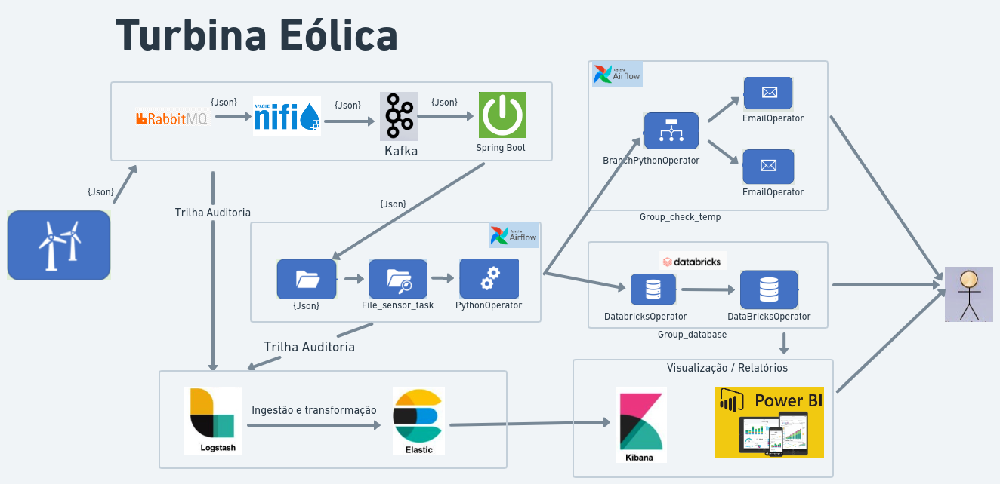

# Projeto-Turbina Eólica

 Projeto Tecnologias de Big Data

##  1) DEFINIÇÃO DE UM PROBLEMA 

  Garantir o acompnhamento dos valores atingidos da temperatura gerada no processo de geração de energia

## 2) DEFINIÇÃO INGESTÃO EM DADOS (LOCAL DA ORIGEM, PODE JA EXISTIR OU PODE SER GERADO)
 
  Turbina Eólica que vai produzir dados e gerar insumos para os sensores mapearem os valores atingidos da temperatura, informando a normalidade ou críticas no processo de geração de energia

## 3) DEFINIÇÃO ARQUITETURA (DESENHO NO MINIMO DE 2 PARTES DO TODO INGESTÃO E AMAZENAMENTO)
  
 Link whimsical <a href="https://whimsical.com/turbina-eolica-vertical-HapdrJPBcaozePY3FjXv25">https://whimsical.com/turbina-eolica-vertical</a>

  
Turbina Eólica que vai produzir dados e gerar insumos para os sensores mapearem os valores atingidos da temperatura, informando a normalidade ou críticas no processo de geração de energia:

      <li> Gerar Arquivo Json (Intervalo de 3 minutos );<l/i>
      <li> File Sensor monitora a Pasta;<l/i>
      <li> Pytho Opertaion (Ler as variáveis do arquivo, colocar as variáveis no Xcom e excluir o arquivo ); </li>
      <li> Branch Python Operator (Verifica o grau de temperatura , <li>mandando o e-mail de alerta ou informativo );</li>
      <li> DatabricksOperator (Cria a tabela e Insere Dados no BD);</li>
      <li> Entrega  dos relatórios pelo Kibana e Power BI;</li>

 ## 4) IMAGEM DOCKER 

Airflow,
Nifi,
Logstash,
Elasticsearch e 
Kibana

## 5) SUBIR NO GIT
